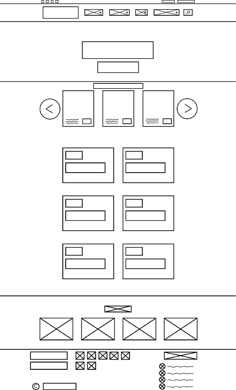
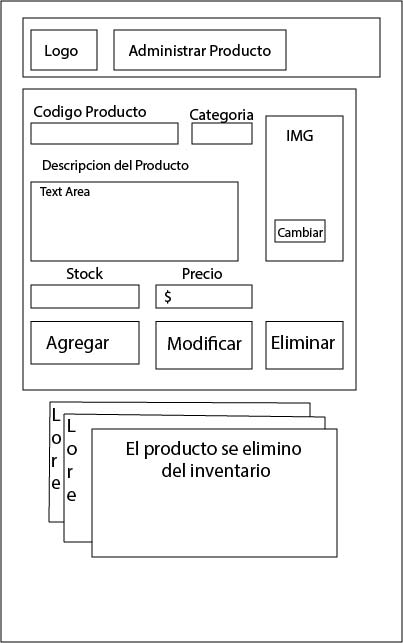
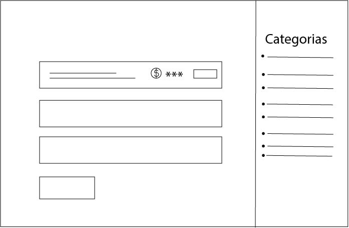

## Grupo_3_Camping
Breve descripcion del sitio: _Venta de elementos para la supervivencia y el bienestar en todo tipo de ambientes y climas, desde indumentaria y accesorios hasta navajas, rifles, elementos de pesca y demas equipamiento y artículos deportivos outdoor._
### Publico objetivo
Campistas casuales, profesionales, entusiastas y participantes de actividades outdoor en general.

### Integrantes del grupo:  

- Matias Bogado: me llamo Matias Bogado ,tengo 35 años, desempleado,  realizo un curso de progaramacion en FORMAR ,pretendo conseguir un trabajo digno.

- Nicolas Iacson: Soy Nicolas Iacson, tengo 18 años, entusiasta de la tecnología, mi objetivo actual es terminar este curso para trabajar de lo que me gusta y seguir formándome en el futuro y poder gestionar un negocio propio en algún momento.

- Federico Melgarejo: 21 años, ayudo en lo que puedo, ya quiero ver este proyecto terminado.

#### Referencias:

https://www.lalomitaoutdoors.com.ar/ _Referencia base, mas cercano a lo que nos interesa lograr._

https://elsoldaditodeplomo.com.ar/ _Diseño del home y categorias._

https://www.total-fishing-tackle.com/ _Ejemplo mas simplificado de lo que pretendemos lograr._

https://freshair.com.ar/ _Marcas._

https://www.campingcenter.com.ar/ _Diseño sencillo y facil de comprender, lo minimo que deberiamos conseguir._

### Home

### Productos

### Formulario de registro

### Formulario carga de productos administrador

### Carrito

